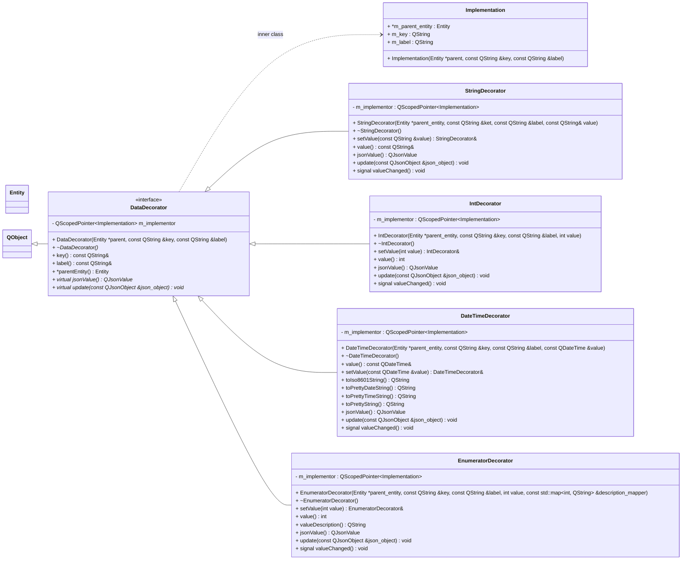

# The hierarchy for different data classes

## Class Diagram

```mermaid
classDiagram
    direction LR
    class Entity

    class QObject

    class DataDecorator {
        <<interface>>

        + DataDecorator(Entity *parent, const QString &key, const QString &label)
        + ~DataDecorator()*

        + key() const QString& 
        + label() const QString& 
        + *parentEntity() Entity

        + virtual jsonValue()* QJsonValue 
        + virtual update(const QJsonObject &json_object)* void

        - QScopedPointer~Implementation~ m_implementor
    }

    QObject <|-- DataDecorator

    class Implementation {
        + Implementation(Entity *parent, const QString &key, const QString &label)

        + *m_parent_entity : Entity
        + m_key : QString
        + m_label : QString
    }

    DataDecorator ..> Implementation : inner class

    class StringDecorator {
        + StringDecorator(Entity *parent_entity, const QString &ket, const QString &label, const QString& value)
        + ~StringDecorator()

        + setValue(const QString &value) StringDecorator&
        + value() const QString&

        + jsonValue() QJsonValue
        + update(const QJsonObject &json_object) void

        + signal valueChanged() void

        - m_implementor : QScopedPointer~Implementation~
    }

    DataDecorator <|-- StringDecorator

    class IntDecorator {
        + IntDecorator(Entity *parent_entity, const QString &key, const QString &label, int value)
        + ~IntDecorator()

        + setValue(int value) IntDecorator&
        + value() int

        + jsonValue() QJsonValue
        + update(const QJsonObject &json_object) void

        + signal valueChanged() void

        - m_implementor : QScopedPointer~Implementation~
    }

    DataDecorator <|-- IntDecorator

    class DateTimeDecorator {
        + DateTimeDecorator(Entity *parent_entity, const QString &key, const QString &label, const QDateTime &value)
        + ~DateTimeDecorator()

        + value() const QDateTime&
        + setValue(const QDateTime &value) DateTimeDecorator&
        + toIso8601String() QString
        + toPrettyDateString() QString
        + toPrettyTimeString() QString
        + toPrettyString() QString

        + jsonValue() QJsonValue
        + update(const QJsonObject &json_object) void
        + signal valueChanged() void

        - m_implementor : QScopedPointer~Implementation~
    }

    DataDecorator <|-- DateTimeDecorator

    class EnumeratorDecorator {
        + EnumeratorDecorator(Entity *parent_entity, const QString &key, const QString &label, int value, const std::map~int, QString~ &description_mapper)
        + ~EnumeratorDecorator()

        + setValue(int value) EnumeratorDecorator&
        + value() int
        + valueDescription() QString

        + jsonValue() QJsonValue
        + update(const QJsonObject &json_object) void
        + signal valueChanged() void

        - m_implementor : QScopedPointer~Implementation~
    }

    DataDecorator <|-- EnumeratorDecorator
```